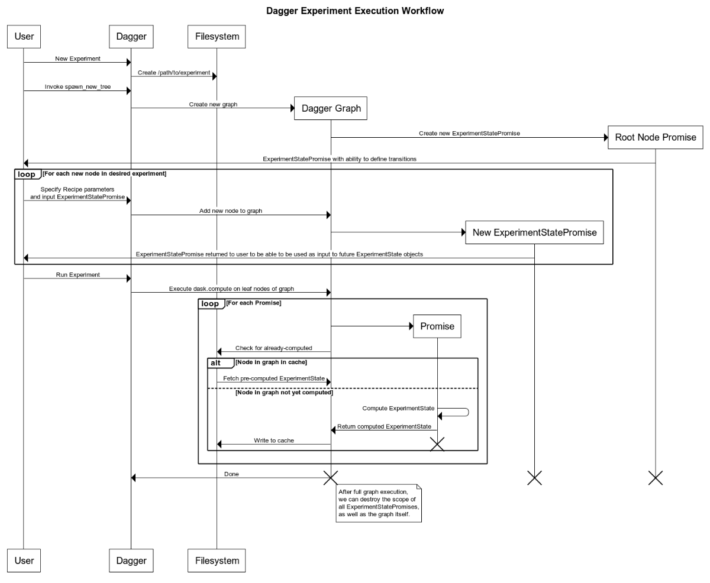

# `dagger`: A Python Framework for Reproducible Machine Learning Experiment Orchestration

[](./LICENSE)

`dagger` is a framework to facilitate reproducible and reusable experiment orchestration in machine learning research.

It allows to build and easily analyze trees of experiment states. Specifically, starting from a root experiment state, `dagger` records state transitions generated by user-defined transformations (through the use of `Recipe`s). These can include model training, reinitialization, quantization, pruning, learning rate changes, checkpointing, task changes, or any other user-defined action that mutates the state of the model or of the experiment.

This library handles all the experiment history tracking behind the scenes by keeping track of how new experiment states result from transformations of existing states. The full experiment can then be represented as a tree of experiment states. This tree structure enables easy visual inspection and interactive analysis of all models in the various states during or after the experiment creation phase.

## Installation

`python setup.py`

## Usage
More in-depth example usage is provided in the tutorials (see [tutorials/](./tutorials/)). 

```python
import dagger as dag
from types import MethodType
# Initialize an experiment by defining the type of experiment states it will 
# hold and the directory where they will be stored
exp = dag.Experiment(
    directory='dagger/examples/', 
    state_class=dag.ExperimentState
)


# CUSTOM BLOCK
# Depending on your experiment design, define what it means to initialize an 
# experiment state. In this case, the root state is simply defined by 
# creating a model.
def initialize_state(state):
    from torchvision.models import resnet18
    state.model = resnet18()

# Add this customization to the ExperimentState class (or subclass it to add 
# more functionalities)
dag.ExperimentState.initialize_state = MethodType(initialize_state, 
                                                  dag.ExperimentState)


# create the root ExperimentState
root = exp.spawn_new_tree()


# CUSTOM BLOCK
# Define the action performed by the Recipe by implementing the `run` method.
# In this example, the recipe simply reinitializes the bias in the last 
# fully-connected layer to all zeros. 
def run(recipe, state):
    state.model.fc.bias.data.zero_()
    return state

# Add this customization to the Recipe class (or subclass it to add 
# more functionalities)
dag.Recipe.run = MethodType(run, dag.Recipe)


# Generate a new state as a child of the root state by modifying the model 
# according to the instructions contained in the Recipe's `run` method.
new_state = dag.Recipe()(root)

# Now that this simple graph has been defined (with one root state and a child
# state that only differ in the ) 
exp.run()

```

## Structure

 * `Experiment`: tree structure that handles the connection and bookkeeping of all experiment states.

 * `StaticExperimentTree`: reconstructed tree structure (after experiments have been run) that allows state filtering and inspection for analysis purposes.

 * `ExperimentState`: represents the state of the experiment at a given point in time, after the action that generated it is complete.

 * `ExperimentStatePromise`: represents a future realization of an experiment state within the experiment graph, before it is executed.

 * `Recipe`: allows to perform a sequence of state-mutating actions and adds a new node to the graph. 

 * `Function`: allows to perform a non-state-mutating operation that therefore doesn't add a new node to the graph.

## Execution Flow Diagram



## License
This project is licensed under the MIT License - see the [LICENSE](./LICENSE) file for details.

## Authors
[@mickypaganini](https://github.com/mickypaganini)

[@jzf2101](https://github.com/jzf2101)
